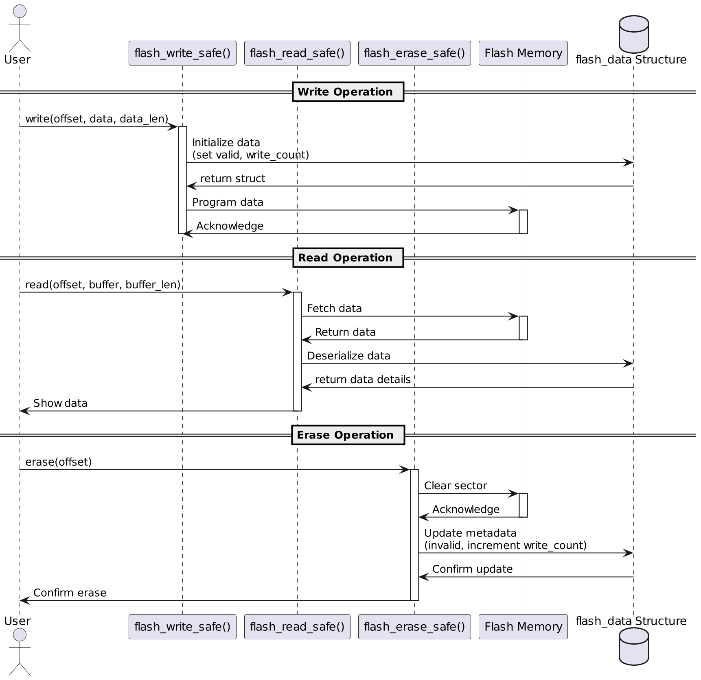
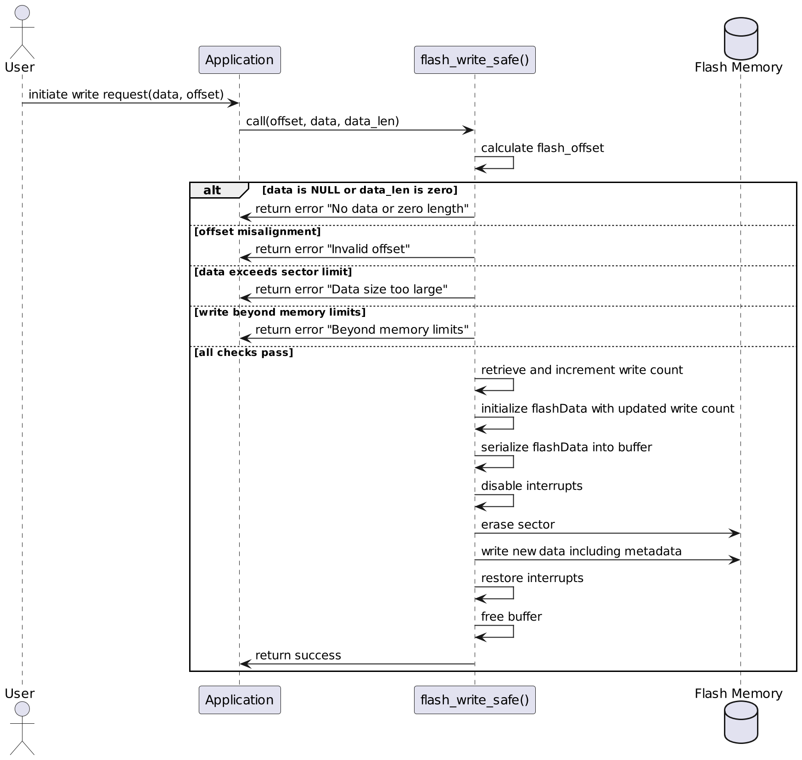
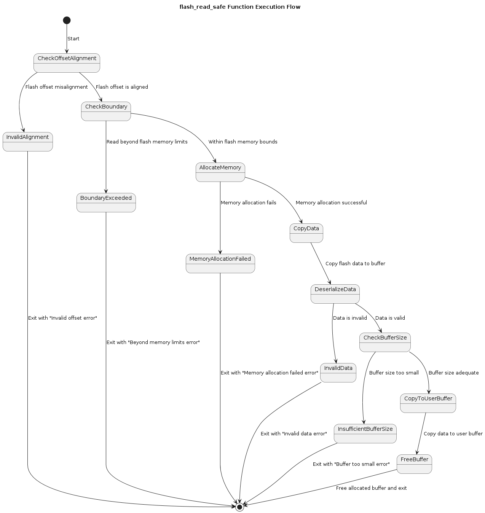
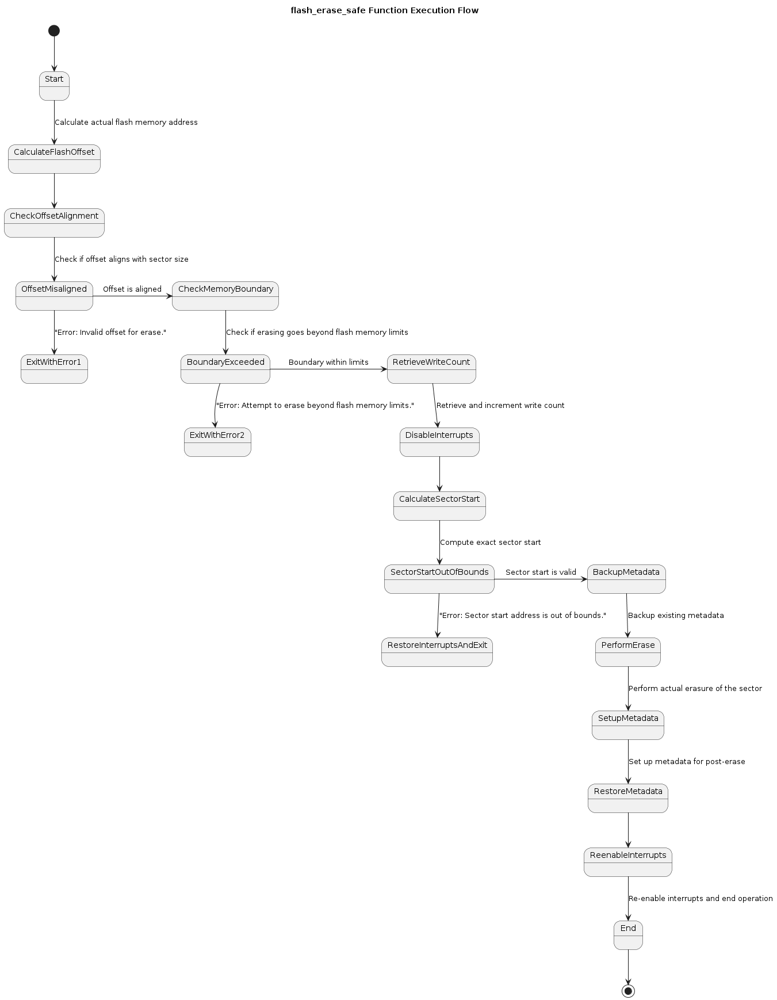
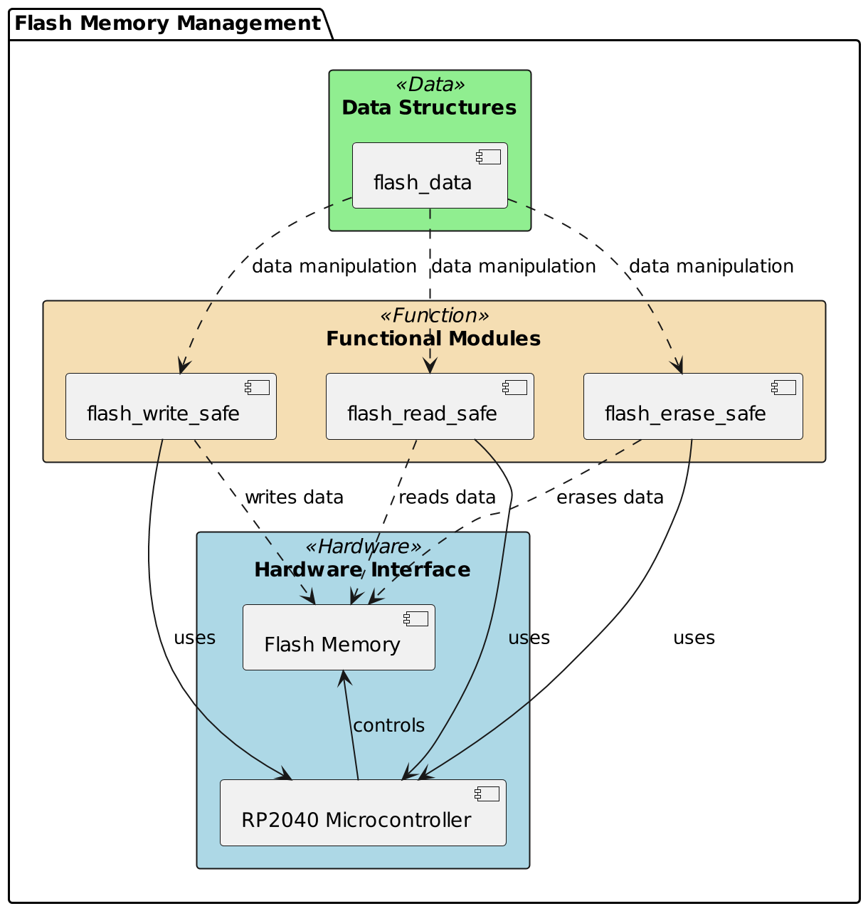

<h1>Worksheet 1 Part 1</h1>

<h2>Communication and Protocols </2>


# Table of Contents

1. [Introduction](#introduction)
   - [Project Overview](#project-overview)
   - [Key Features](#key-features)
2. [Getting Started](#getting-started)
   - [Prerequisites](#prerequisites)
   - [Installation](#installation)
   - [Building the Project](#building-the-project)
   - [Deploying the Firmware](#deploying-the-firmware)
3. [Quick Start Guide](#quick-start-guide)
4. [Usage](#usage)
   - [Basic Examples](#basic-examples)
   - [Advanced Features](#advanced-features)
5. [Architecture](#architecture)
   - [System Overview](#system-overview)
   - [Memory Management](#memory-management)
6. [Function Details](#function-details)
   - [flash_write_safe](#flash_write_safe)
   - [flash_read_safe](#flash_read_safe)
   - [flash_erase_safe](#flash_erase_safe)
7. [Structured Data Management](#structured-data-management)
   - [flash_data Structure](#flash_data-structure)
   - [DeviceConfig Structure](#deviceconfig-structure)
8. [Testing](#testing)
   - [Test Suite Overview](#test-suite-overview)
   - [Running Tests](#running-tests)
9. [API Documentation](#api-documentation)
10. [Performance Benchmarks](#performance-benchmarks)
11. [Troubleshooting](#troubleshooting)
12. [FAQ](#faq)
13. [Community and Contributions](#community-and-contributions)
14. [Acknowledgments](#acknowledgments)
15. [Security](#security)
16. [Versioning and Changelog](#versioning-and-changelog)
17. [License](#license)
18. [Contact](#contact)
19. [UML Diagrams](#uml-diagrams)
   - [Function Interaction](#function-interaction)
   - [Data Flow](#data-flow)


# Introduction

This repository contains a collection of  functions designed to support operations on the flash memory of the Raspberry Pi Pico microcontroller. These functions extend the basic functionalities of interacting with the flash memory. Moreover this repo provides more specific and often complex operations that involve reading and writing structured data to and from the flash memory, as well as managing serialization and deserialization processes.

## Project Overview

The project is centered around developing  software for managing the flash memory on the Raspberry Pi Pico. Given the Pico's constraints and capabilities, the software is designed to handle flash memory operations that are crucial for maintaining data integrity, especially in applications requiring non-volatile storage solutions. The software ensures that all read, write, and erase operations on the flash are performed safely, adhering to best practices in embedded systems programming.

Key aspects include:
- Ensuring alignment with flash memory sector boundaries to avoid partial writes or erases.
- Implementing rigorous checks to prevent operations from exceeding the flash memory's physical boundaries.
- Utilizing a structured approach to manage data effectively, which includes keeping track of the number of write operations to aid in wear leveling.

## Key Features

- **Safe Flash Memory Operations**: Ensures that all write, read, and erase operations are conducted within the strict boundaries and specifications of the hardware, protecting against common flash memory issues like data corruption or unintended overwrites.
- **Wear Leveling Support**: Tracks write operations to each sector, helping distribute the wear more evenly across the flash memory, which is crucial for prolonging the life of the device's memory.
- **Error Handling**: Robust error handling capabilities that provide clear feedback and prevent operations under unsafe conditions, such as misaligned accesses or attempts to operate outside the memory boundaries.
- **Structured Data Management**: Supports operations on structured data, allowing for serialized/deserialized data operations directly on the flash memory, which is useful for applications requiring the storage and retrieval of configuration settings or device states.
- **Extensive Testing**: Includes a comprehensive suite of tests that validate the functionality and robustness of flash memory operations under various conditions, ensuring reliability and stability in deployment.

This project aims to deliver a reliable and efficient toolset for Raspberry Pi Pico developers, enhancing their ability to build stable and durable embedded systems.


# Getting Started

This section guides you through getting your development environment set up and running the project. Follow these steps to start using the software on your Raspberry Pi Pico.

## Prerequisites

Before you begin, ensure you have the following prerequisites installed:
- **Raspberry Pi Pico SDK**: Ensures that you have the necessary libraries and tools to develop for the Raspberry Pi Pico.
- **CMake**: Used for building the software from source.
- **GNU Make**: Required for automating the build process.
- **Git**: Needed to clone the repository and manage the source code versions.
- **Python 3**: For running scripts that might be needed during setup or deployment.

Ensure that your development environment is set up according to the [official Raspberry Pi Pico documentation](https://www.raspberrypi.org/documentation/rp2040/getting-started/).

## Installation

To install the software, you need to clone the project repository and prepare your Raspberry Pi Pico for the firmware:

1. **Clone the Repository**:
   Open a terminal and run the following command to clone the repository:
   ```bash
   git clone https://gitlab.uwe.ac.uk/a2-imeri/cap_template.git
   ```

This command downloads the latest version of this project  on your local machine.

### Prepare the Raspberry Pi Pico
Connect your Raspberry Pi Pico to your computer in bootloader mode. This is typically done by holding the BOOTSEL button while plugging the Pico into the USB port of your computer.

### Building the Project

After installing the prerequisites and cloning the repository, you can build the project as follows:

#### Navigate to the Build Directory
Change into the build directory inside the cloned repository:
```bash
cd cap_template/build
```
#### Build the Project
Use CMake and Make to compile the project. Run the following commands in the terminal:

```bash
cmake ..
make
```

### Deploy the Firmware

Once the build is successful, a file named `cap_template.uf2` will be generated. Copy this file to your Raspberry Pi Pico, which appears as a mass storage device when in bootloader mode. Simply drag and drop or copy-paste the `cap_template.uf2` file onto the Pico.

After these steps, your Raspberry Pi Pico will reboot automatically, and the new firmware will start running. You can now begin working with the provided software functionalities for flash memory operations.


## Architecture

This section provides an in-depth look at the software architecture of the flash memory operations designed for the Raspberry Pi Pico. It discusses the overall system structure, focusing on memory management techniques and how the software interacts with the RP2040 microcontroller's hardware capabilities to manage flash memory efficiently.

### System Overview

The software architecture is structured around modular components that manage the flash memory on the Raspberry Pi Pico. This includes routines for reading, writing, and erasing flash memory, along with advanced management features such as wear leveling and error handling.

- **Components**:
  - **Flash Operations**: Core functions that perform low-level flash memory operations.
  - **Helper Functions**: Utility functions that assist with tasks like data serialization/deserialization and memory calculations.
  - **Error Management**: Robust error handling mechanisms that ensure the system's reliability and stability during flash operations.

- **Integration**:
  - How the software interfaces with the RP2040’s hardware features to execute flash memory operations.
  - Explanation of the integration points with the Pico SDK and other libraries.

### Memory Management

Memory management within this project is crucial for ensuring efficient use of the RP2040's flash memory. This section outlines the strategies and implementations used to handle memory safely and effectively.

- **Flash Memory Layout**:
  - **Sector Management**: Details on how flash memory sectors are managed, including sector allocation for different types of data and the importance of alignment.
  - **Metadata Management**: Describes how metadata is used to track the state and integrity of data blocks within the flash memory.

- **Memory Operations**:
  - **Writing to Flash**: Deep dive into the `flash_write_safe` function, which includes steps for ensuring data alignment, preventing data corruption, and managing write wear.
  - **Reading from Flash**: Examination of the `flash_read_safe` function, focusing on how data integrity checks are performed before data is read.
  - **Erasing Flash**: Insights into the `flash_erase_safe` function, explaining how sectors are safely erased while preserving essential metadata.

- **Safety and Integrity**:
  - **Data Validation**: Techniques used to validate data before operations are executed to prevent errors and data corruption.
  - **Wear Leveling**: Strategies implemented to evenly distribute write and erase cycles across the flash memory to extend its lifespan.

### Architectural Diagram

- 




This architecture overview provides a clear understanding of how the flash memory management software is structured and operates within the context of the Raspberry Pi Pico environment. It serves as a guide for developers looking to extend or integrate this functionality into their projects.


## Function Details: `flash_write_safe`

### Overview
The `flash_write_safe` function is designed to write data to the flash memory in a safe and controlled manner. It ensures that all write operations adhere to flash memory constraints such as alignment requirements and sector boundaries, which are critical for avoiding data corruption.

### Signature
```c
void flash_write_safe(uint32_t offset, const uint8_t *data, size_t data_len);
```
### Parameters

- **`offset`**: The offset from the base of the flash memory where data writing begins. This offset needs to be aligned with the flash sector size.
- **`data`**: Pointer to the data buffer that needs to be written to flash.
- **`data_len`**: The length of the data in bytes that will be written to flash.

### Operational Logic

- **Offset Validation**:
  - The function first checks if the offset is aligned with the flash sector size. Flash memory typically requires that write operations begin at sector boundaries to avoid partial writes that can lead to data corruption.

- **Data Validation**:
  - It checks if the data pointer is NULL and if `data_len` is greater than zero. Writing operations with invalid data pointers or zero length are rejected to prevent runtime errors and undefined behavior.

- **Boundary Checks**:
  - The function calculates if the data to be written stays within the physical memory limits of the flash. This prevents any attempt to write data beyond the available flash memory, which can overwrite other critical data or system areas.

- **Sector Erase and Write**:
  - Before new data can be programmed into flash memory, the relevant sector(s) must be erased. `flash_write_safe` handles this by first erasing the sector at the specified offset.
  - After erasing, the data is written to the flash memory. This two-step process ensures that the flash memory is ready to receive new data and that the data is written correctly.

### Importance

- **Data Integrity**: Ensures that each write operation is performed correctly without corrupting other data, crucial for systems where data reliability is key.
- **System Stability**: By enforcing boundary and alignment checks, the function prevents system crashes and data corruption scenarios that could arise from improper flash memory operations.
- **Performance Considerations**: While ensuring safety, the function is also designed to be as efficient as possible under the constraints of operating directly with hardware.

### Diagram



### Example Usage

Here's how you might use `flash_write_safe` in an application:

```c
#include "flash_ops.h"

void example_write_to_flash() {
    const uint8_t sample_data[] = {0x01, 0x02, 0x03, 0x04};
    uint32_t flash_offset = 0x1000; // Example offset, aligned as required.

    flash_write_safe(flash_offset, sample_data, sizeof(sample_data));
    // Additional logic to verify the write or handle errors could be added here.
}
```

## Capabilities and Limitations of `flash_write_safe`

| Feature                                           | Supported          |
|---------------------------------------------------|--------------------|
| Data Alignment Verification                       | :white_check_mark: |
| Boundary Check                                    | :white_check_mark: |
| Sector Erase Before Writing                       | :white_check_mark: |
| Data Size Validation                              | :white_check_mark: |
| Handling of Null Data Pointers                    | :white_check_mark: |
| Increment Write Counter                           | :white_check_mark: |
| Serialization of Data Structures                  | :white_check_mark: |
| Writing Beyond Flash Memory Limits                | :x:                |
| Automatic Wear Leveling                           | :x:                |
| Real-Time Data Encryption                         | :x:                |
| Asynchronous Writing                              | :x:                |
| Data Compression Before Writing                   | :x:                |

### Detailed Feature Descriptions

- **Data Alignment Verification**: Ensures that write operations begin at sector boundaries to avoid partial writes and potential data corruption.
- **Boundary Check**: Verifies that write operations do not exceed the physical limits of the flash memory, safeguarding against overwriting critical data.
- **Sector Erase Before Writing**: Automatically erases the sector before programming new data, ensuring a clean state for reliable data storage.
- **Data Size Validation**: Checks if the data length exceeds the permissible limits for a single sector, accounting for metadata, and rejects oversized data.
- **Handling of Null Data Pointers**: Properly manages cases with null data pointers to prevent runtime errors.
- **Increment Write Counter**: Accurately tracks and increments the write count for each sector, which is crucial for monitoring flash wear and implementing wear leveling strategies.
- **Serialization of Data Structures**: Effectively serializes structured data into a byte array for flash storage, handling complex data types efficiently.
- **Writing Beyond Flash Memory Limits**: Does not support operations that attempt to write data beyond the established flash memory boundaries, to prevent system instability and data loss.
- **Automatic Wear Leveling**: The function does not automatically distribute write operations to extend the lifespan of the flash memory, which could be a limitation in systems requiring enhanced durability.
- **Real-Time Data Encryption**: Lacks the capability to encrypt data on-the-fly before writing to flash, which might be necessary for applications with high security requirements.
- **Asynchronous Writing**: Operates synchronously, which might not be optimal for applications requiring non-blocking operations.
- **Data Compression Before Writing**: Does not compress data before writing, which could be a limitation in scenarios where memory utilization efficiency is critical.


### Conclusion

This function is a foundational component of flash memory management in embedded applications, especially in systems like the Raspberry Pi Pico where direct control over hardware is a frequent requirement. It showcases how embedded systems handle low-level operations that are typically abstracted away in higher-level programming environments. This detailed control and precise handling ensure that the hardware's capabilities are maximally utilized while maintaining system integrity and reliability.```

This passage gives a concluding overview of the significance of the `flash_write_safe` function in the context of embedded system programming, emphasizing its critical role in low-level hardware management. It could be included towards the end of the section discussing the `flash_write_safe` function to wrap up the explanation and highlight the importance of such functions in practical scenarios.


## Function Details: `flash_read_safe`

### Overview

The `flash_read_safe` function is designed to safely read data from the flash memory at a specified offset, ensuring that the operation adheres to flash memory alignment and boundary requirements to prevent data corruption and access errors. This function only proceeds with reading if the data is marked valid and is correctly initialized.

### Signature

```c
void flash_read_safe(uint32_t offset, uint8_t *buffer, size_t buffer_len);

```
## Parameters

- **`offset`**: The offset from the base of the flash memory where the read starts.
- **`buffer`**: The buffer to store the read data.
- **`buffer_len`**: The length of the buffer to ensure no overflow occurs during the read.

## Operational Logic

- **Offset Calculation**:
  - Calculates the actual flash memory address by adding the provided offset to the base address of the flash. This address is used for all subsequent read operations.

- **Offset Validation**:
  - Checks if the flash offset is aligned with the sector size. Misalignment can cause partial sector read issues, leading to potential data corruption.

- **Boundary Check**:
  - Verifies that the read operation does not extend beyond the flash memory's physical limits, protecting against attempts to access undefined memory areas.

- **Memory Allocation**:
  - Allocates a buffer large enough to hold the metadata and the requested data. This buffer is used to temporarily store data read from flash.

- **Data Transfer**:
  - Copies data from the flash memory starting at the calculated offset into the allocated buffer. This includes the metadata and the actual data.

- **Data Validation and Copy**:
  - Deserializes the buffer into a structured format to access the metadata and validates the integrity of the data.
  - If the data is marked as valid and the buffer size is sufficient, it copies the data to the user-provided buffer. Otherwise, it handles errors such as invalid data or insufficient buffer size.

- **Cleanup**:
  - Frees the allocated buffer to avoid memory leaks.

## Error Handling

Handles several error scenarios gracefully, providing clear error messages for:
- **Misalignment of the read offset**.
- **Attempts to read beyond the flash memory's boundaries**.
- **Insufficient buffer size provided by the caller**.
- **Encountering invalid data at the specified offset**.

## Diagram



## Example Usage

Here's how you might use `flash_read_safe` in an application:

```c
#include "flash_ops.h"

void example_read_from_flash() {
    uint8_t buffer[256]; // Allocate a buffer for reading
    uint32_t offset = 0x1000; // Example offset, aligned as required

    flash_read_safe(offset, buffer, sizeof(buffer));
    // Additional logic to verify the read or handle errors could be added here
}
```

## Capabilities and Limitations of `flash_read_safe`

| Feature                                           | Supported          | Details                                                      |
|---------------------------------------------------|--------------------|--------------------------------------------------------------|
| Offset Alignment Verification                     | :white_check_mark: | Ensures read operations begin at sector boundaries.          |
| Boundary Check                                    | :white_check_mark: | Prevents reading beyond the flash memory's physical limits.  |
| Handling of NULL Pointers for Buffer              | :x:                | Does not explicitly handle NULL pointers for buffer.         |
| Data Validity Check                               | :white_check_mark: | Proceeds only if data is marked valid.                       |
| Memory Allocation for Read Operation              | :white_check_mark: | Allocates memory dynamically to handle read data.            |
| Error Handling for Misalignment and Overflows     | :white_check_mark: | Provides clear error messages for misalignment and overflows. |
| Deserialization of Data                           | :white_check_mark: | Converts data from raw flash format to structured data.      |
| Buffer Size Validation                            | :white_check_mark: | Checks if provided buffer is sufficient for data length.     |
| Real-Time Data Decompression                      | :x:                | Does not support decompression of data.                      |
| Data Encryption/Decryption Handling               | :x:                | Does not handle encrypted data.                              |
| Asynchronous Read Operations                      | :x:                | Supports only synchronous operations.                        |
| Automatic Memory Management                       | :x:                | Requires manual management of memory allocation/free.        |

### Additional Notes
- **Offset Alignment Verification** and **Boundary Check** are crucial for maintaining the integrity of data reads, ensuring that operations do not disrupt the system's stability by reading inappropriate memory areas.
- **Data Validity Check** ensures that corrupted or uninitialized data is not mistakenly read, which could lead to errors or undefined behavior in the application using this data.
- **Error Handling**: The function is robust in providing feedback for various common errors such as misalignment or attempts to read beyond the available memory, which helps in debugging and maintaining the system.
- **Memory Management**: Users of this function need to be aware that while the function allocates memory for reading data, it also requires the caller to manage the memory post-operation, specifically to free the allocated buffer.

This table aims to provide a comprehensive overview of what the `flash_read_safe` function can do and its limitations, helping developers understand how to integrate it into their systems and what additional measures might be needed to handle its limitations.


## Function Details: `flash_erase_safe`

### Overview

The `flash_erase_safe` function is meticulously designed to securely erase a sector of the flash memory at a specified offset. This critical operation adheres strictly to alignment and boundary conditions specific to flash memory. By ensuring that the sector is correctly aligned and within the permissible boundaries, the function avoids partial erasures and potential data corruption. During the erase process, it preserves essential metadata, which is crucial for maintaining data integrity and supporting overall system stability. This function is pivotal in applications where data security and integrity are paramount.

### Signature

```c
void flash_erase_safe(uint32_t offset);
```
## Parameters

- **`offset`**: The offset within the flash memory where the sector begins to be erased.

## Operational Logic

- **Offset Calculation and Validation**:
  - The function calculates the actual address in flash memory where the erasure will start, factoring in the specified offset.
  - It checks if this offset aligns with the sector size. Misalignment can lead to partial sector erasures, which might cause data integrity issues.

- **Boundary Check**:
  - Ensures that the erasing process does not exceed the limits of the flash memory to prevent corrupting data outside the intended sector.

- **Write Count Retrieval and Increment**:
  - Retrieves the current write count for the sector from metadata, increments it to track the number of erase cycles, aiding in wear leveling.

- **Interrupts Handling**:
  - Disables interrupts to maintain the atomicity of the erase operation, ensuring it is not interrupted and potentially left incomplete.

- **Sector Start Calculation**:
  - Computes the exact start of the sector ensuring it aligns correctly with sector boundaries.

- **Metadata Backup and Erase**:
  - Backs up metadata before erasing to preserve critical data like write counts.
  - Performs the actual erasure of the sector.

- **Metadata Restoration**:
  - After erasing, restores essential metadata at the start of the sector to maintain data integrity. Marks data as invalid since the sector has been erased.

- **Restore Operation State**:
  - Re-enables interrupts after completing the erase to return the system to its normal operational state.


## Diagram 



## Error Handling

- **Offset Misalignment**: Returns an error if the offset does not align with sector boundaries, preventing accidental data corruption.
- **Boundary Exceedance**: Stops the operation with an error if the erasure would go beyond flash memory limits, safeguarding against potential system instability.

## Example Usage

Here's a basic example of how to use `flash_erase_safe` in an application:

```c
#include "flash_ops.h"

void example_erase_sector() {
    uint32_t offset = 0x1000; // Ensure this offset is within the flash memory's limits and properly aligned
    flash_erase_safe(offset);
    // Additional logic to handle post-erase operations or check results might be added here
}
```


## Capabilities and Limitations of `flash_erase_safe`

| Feature                                       | Supported          | Details                                                      |
|-----------------------------------------------|--------------------|--------------------------------------------------------------|
| Alignment Verification                        | :white_check_mark: | Ensures erasure only occurs if the offset aligns with sector boundaries. |
| Boundary Check                                | :white_check_mark: | Prevents erasure beyond the flash memory's physical limits.  |
| Metadata Preservation                         | :white_check_mark: | Preserves essential metadata like write counts before erasing. |
| Error Handling for Misalignment and Overflows | :white_check_mark: | Provides clear error messages for misalignment and attempts to erase beyond limits. |
| Interrupt Handling                            | :white_check_mark: | Disables interrupts during erasure to ensure operation atomicity. |
| Sector Erasure Accuracy                       | :white_check_mark: | Computes exact sector start and performs precise erasure.    |
| Metadata Restoration                          | :white_check_mark: | Restores metadata post-erasure to ensure flash management data integrity. |
| Automatic Reallocation                        | :x:                | Does not handle reallocation of data within flash storage.   |
| Asynchronous Operation                        | :x:                | Operation is synchronous, potentially blocking system operations during erase. |
| Data Recovery                                 | :x:                | Does not support recovery of erased data, ensuring data is irrecoverable post-erase. |

### Additional Notes
- **Alignment Verification** and **Boundary Check** are critical to avoid data corruption and ensure that the erase operation affects only the intended sector.
- **Error Handling**: The function is robust in providing feedback and preventing operations that could lead to system instability or data loss.
- **Interrupt Handling** and **Sector Erasure Accuracy** are essential for maintaining system performance and integrity during potentially disruptive operations like erasing flash sectors.
- **Metadata Restoration** helps in maintaining the management and operational continuity of flash memory by ensuring that metadata remains consistent and accurate, even after an erase operation.
- **Limitations**: The synchronous nature of the operation could impact system responsiveness, especially in systems with real-time requirements.

This table should be useful for developers and system architects in understanding the operational scope, reliability features, and potential constraints of the `flash_erase_safe` function.


## Structured Data Management

In managing flash memory operations, particularly for functions such as `flash_write_safe`, `flash_read_safe`, and `flash_erase_safe`, the `flash_data` struct plays a crucial role. Below is a breakdown of each component of this struct and what it represents:

### `flash_data` Structure Definition

```c
typedef struct {
    bool valid;             // Indicates if the data is considered valid.
    uint32_t write_count;   // Tracks the number of times the data has been written to ensure wear leveling.
    size_t data_len;        // Specifies the length of the data in bytes.
    uint8_t *data_ptr;      // Points to the actual data stored in flash.
} flash_data;
```

## Field Descriptions

- **valid**:
  - *Type*: bool
  - *Description*: This flag indicates whether the data stored in the flash memory is valid and can be trusted. It is used to verify data integrity during read operations and to manage data validity during erases and writes.

- **write_count**:
  - *Type*: uint32_t
  - *Description*: Maintains a count of how many times the data has been written to the flash. This information is essential for implementing wear leveling strategies, which help extend the lifespan of the flash memory by distributing write and erase cycles across different sectors.

- **data_len**:
  - *Type*: size_t
  - *Description*: Specifies the length of the data stored in bytes. This length is critical for ensuring that read and write operations handle the correct amount of data, preventing buffer overflows and ensuring data integrity.

- **data_ptr**:
  - *Type*: uint8_t *
  - *Description*: Points to the actual data stored within the flash memory. This pointer is used during read and write operations to directly access the data stored in flash.


## Diagram 



## Importance of Structured Data Management

Properly managing the data structure and ensuring each field is accurately maintained and utilized is vital for the stability and reliability of flash memory operations. The `flash_data` struct not only facilitates precise control over data operations but also enhances data integrity, wear leveling, and efficient memory usage. By understanding and utilizing this struct effectively, developers can ensure that their applications perform optimally with respect to non-volatile storage requirements.


## Structured Data Management: `DeviceConfig`

The `DeviceConfig` struct is designed to encapsulate configuration details of a device, making it easier to manage and access various attributes related to a specific hardware device or sensor within the system. Below is the definition and description of each field within this struct:

### `DeviceConfig` Structure Definition

```c
typedef struct {
    uint32_t id;          // Unique identifier for the device.
    float sensor_value;   // Current value read from the device's sensor.
    char name[10];        // A descriptive name for the device.
} DeviceConfig;

```
## Field Descriptions for `DeviceConfig`

## Field Descriptions for `DeviceConfig`

- **`id`**:
  - **Type**: `uint32_t`
  - **Description**: This field stores a unique identifier for the device. It is crucial for distinguishing between different devices, especially in systems where multiple devices of the same type are managed concurrently.

- **`sensor_value`**:
  - **Type**: `float`
  - **Description**: Holds the latest reading from the device’s sensor. This could represent any measurable parameter depending on the device's functionality, such as temperature, pressure, or humidity.

- **`name`**:
  - **Type**: `char[10]`
  - **Description**: Provides a short, human-readable name or label for the device. This is particularly useful in user interfaces or logs where device identification is needed for better readability and management.

## Importance of Structured Data Management in Device Configuration

Managing data using structured formats like the `DeviceConfig` struct simplifies the process of data handling by:

- **Centralizing device information**: All relevant details about a device are stored in a single, accessible location.
- **Facilitating data transmission**: Easy to serialize and send over networks or store in databases.
- **Enhancing maintenance and scalability**: Simplifies the process of updating, debugging, and scaling the management of multiple devices within the system.

Structured data management using structures like `DeviceConfig` helps in maintaining clarity, ensuring data integrity, and improving the efficiency of operations involving device configurations.


## Testing Coverage for Flash Memory Operations

| Test Function                      | Description                                                         | Implemented |
|------------------------------------|---------------------------------------------------------------------|:-----------:|
| `test_unaligned_offset`            | Verifies handling of unaligned memory offsets.                      | ✔️           |
| `test_flash_beyond_flash_limits`   | Checks the system's response to operations beyond flash boundaries. | ✔️           |
| `test_null_or_zero_data`           | Tests responses to null data pointers and zero data length.         | ✔️           |
| `test_exceed_sector_size`          | Ensures data sizes exceeding sector limits are handled correctly.   | ✔️           |
| `test_save_and_recover_struct`     | Validates serialization, storage, and recovery of structured data.  | ✔️           |
| `test_full_cycle_operation`        | Tests a complete cycle of write, read, and erase operations.        | ✔️           |
| `test_flash_write_count_persistence` | Examines if write counts are properly maintained through cycles.   | ✔️           |
| `test_data_length_retrieval`       | Checks accuracy of data length metadata before and after operations. | ✔️           |

### Detailed Testing Descriptions

1. **Unaligned Offset Handling**:
   - Ensures that operations do not proceed or corrupt data when the offset is not sector-aligned.

2. **Boundary Condition Testing**:
   - Confirms that attempts to perform flash operations beyond the physical memory limits are handled without corrupting data.

3. **Null and Zero-Length Data**:
   - Validates that the system properly rejects write operations when provided with null pointers or zero-length data to avoid crashes.

4. **Exceeding Sector Size**:
   - Ensures that the system correctly handles attempts to write data blocks larger than the flash sector size minus the space required for metadata.

5. **Structured Data Handling**:
   - Tests the complete process of saving and recovering a device configuration, focusing on serialization and deserialization integrity.

6. **Full Operation Cycle**:
   - Confirms the integrity and reliability of the flash operations by ensuring that data can be written, read accurately, and then erased without residual data.

7. **Write Count Persistence**:
   - Ensures that the write count metadata is accurately maintained through multiple write and erase cycles, supporting wear leveling strategies.

8. **Data Length Metadata Accuracy**:
   - Validates that the system correctly updates and resets data length metadata associated with flash memory operations.

This structured approach to testing ensures that all aspects of flash memory management are thoroughly vetted, maintaining high reliability and stability of the embedded system.
